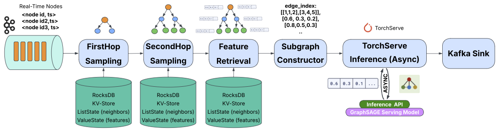

# Bridging GNN Inference and Dataflow Stream Processing: Challenges and Opportunities
This repository includes the implementation of streaming GNN inference described in the [GRADES-NDA 2025 paper](https://dl.acm.org/doi/10.1145/3735546.3735856).
You can cite the paper using the BibTeX below:
```bibtex
@inproceedings{10.1145/3735546.3735856,
author = {Shami, Naima Abrar and Kalavri, Vasiliki},
title = {Bridging GNN Inference and Dataflow Stream Processing: Challenges and Opportunities},
year = {2025},
isbn = {9798400719233},
publisher = {Association for Computing Machinery},
address = {New York, NY, USA},
url = {https://doi.org/10.1145/3735546.3735856},
doi = {10.1145/3735546.3735856},
abstract = {Graph Neural Networks (GNNs) have the potential to address real-world problems involving continuously evolving, graph-structured data, such as fraud detection, real-time recommendations, and traffic monitoring. These applications require the timely processing of streaming (possibly unbounded) data, highlighting the need of integrating GNN inference with dataflow stream processing systems, like Apache Flink. In this paper, we present the first exploration of bridging this gap, by designing a streaming GNN serving pipeline with Flink and PyTorch. We propose a dataflow architecture that offloads subgraph construction to Flink, leveraging its state management and distributed processing capabilities. Despite achieving viable performance through asynchronous inference requests and careful parallelism tuning, we also identify significant limitations stemming from Flink's state scoping, lack of iterative processing, and computation pipelining. We propose solutions that mitigate these issues within Flink and discuss open challenges towards developing dataflow systems tailored to streaming GNN inference.},
booktitle = {Proceedings of the 8th Joint Workshop on Graph Data Management Experiences \& Systems (GRADES) and Network Data Analytics (NDA)},
articleno = {7},
numpages = {10},
keywords = {Graph Neural Networks, Stream Processing},
location = {Berlin, Germany},
series = {GRADES-NDA '25}
}
```
GNN_InferenceStream is a real-time pipeline for streaming Graph Neural Network (GNN) inference using Apache Flink and TorchServe.
It continuously processes incoming node events (e.g. node IDs), dynamically constructs 2-hop neighborhoods from a static graph, and performs GNN inference on the fly using a pre-trained PyTorch model. This enables the generation of fresh node embeddings in response to live events, without needing to retrain or batch-process the entire graph. This is essential in use cases like fraud detection, where suspicious transactions must be flagged instantly based on graph structure; recommendation systems, where user-item interactions trigger updated embeddings; or social network analysis, where friend suggestions or content ranking can depend on the evolving local topology of each user.

### Use Case example: Social Network Friend Recommendation
To illustrate the utility of this pipeline, consider a **social media platform** aiming to provide **real-time friend recommendations** based on evolving user interactions.

#### Graph structure

- **Nodes**: Each user is represented as a node with features such as age, location, interests, and activity levels.
- **Edges**: Friendships or interactions between users form edges

### Streaming inference flow

The pipeline (as shown below) processes a stream of **target node ID events**, where each event could represent a node that requires fresh inference, for example, a user logging in, viewing content, or triggering a recommendation request. For every incoming node ID, the system constructs its 2-hop neighborhood from the static graph, retrieves all relevant features, and sends the subgraph to a pre-trained GNN model hosted on TorchServe. The model returns a fresh embedding or classification output, which can then be used for tasks such as friend recommendations, content ranking, or user behavior prediction.



### 1. Build the Flink Job
From the repo root:
```bash
mvn clean package
```
(Optional) Run all tests
```bash
mvn clean test -U
```

### 2. Start the Flink Cluster

From your Flink installation directory:

```bash
cd <path-to-flink>/bin
./start-cluster.sh
```

### 3. Launch the DataLoader
Submit the Flink job that loads the graph (edges + features) into RocksDB state:
```bash
./flink run -c org.example.DataLoader target/fourth-1.0-SNAPSHOT.jar
```

### 4. Take a Savepoint
Once the DataLoader is running, you can capture a savepoint.
```bash
./flink savepoint <job-id> savepoints/
```

### 5. Launch the TwoHop Inference Job
Use the savepoint path from the previous step to resume state:
```bash
./flink run \
  -s savepoints/savepoint-xxxxxxxxxxxxxxxx \
  --allowNonRestoredState \
  -c org.example.TwoHop \
  target/fourth-1.0-SNAPSHOT.jar \
  <auth_token> <first_hop_limit> <second_hop_limit> <nodes_per_100ms>

```
**Parameters:**

- `<auth_token>` — TorchServe Inference Bearer token retrieved from `key_file.json`  
- `<first_hop_limit>` — Maximum number of 1-hop neighbors to retrieve  
- `<second_hop_limit>` — Maximum number of 2-hop neighbors per 1-hop node  
- `<nodes_per_100ms>` — Number of synthetic node IDs generated every 100ms (i.e. source rate)

### 6. Start Kafka and ZooKeeper
```bash
bin/zookeeper-server-start.sh config/zookeeper.properties
bin/kafka-server-start.sh config/server.properties
bin/kafka-topics.sh --create \
  --topic node-id-topic \
  --bootstrap-server localhost:9092 \
  --partitions 1 \
  --replication-factor 1
```
### 7. Run NodeIdProducer
This generates synthetic node IDs and sends them to the Kafka topic (node-id-topic):
```bash
cd /path/to/project
java -cp target/fourth-1.0-SNAPSHOT.jar org.example.NodeIdProducer
```

### 8. (Optional) Monitor Inference Results
To verify that embeddings are being produced, consume messages from the Kafka sink topic:
```bash
bin/kafka-console-consumer.sh \
  --bootstrap-server localhost:9092 \
  --topic inference-results-topic \
  --from-beginning
```
### 9. Run Experimental Scripts
This script can be used to reproduce experimental metrics used in the evaluation of the paper.
```bash
cd scripts
python3 collect_metrics.py
```


